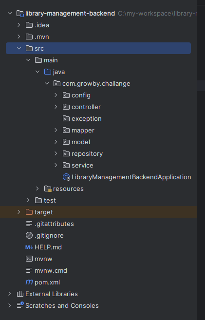

# 📚 Gestión de Biblioteca - Backend

## Descripción del Proyecto

El proyecto **Gestión de Biblioteca** es un microservicio diseñada para gestionar libros, autores y préstamos en una biblioteca. Incluye servicios rest para agregar, editar, eliminar y listar libros, autores y préstamos.

---

## 🛠️ Tecnologías Utilizadas

- **Lenguaje:** Java 17
- **Framework:** Spring Boot 3.2.11
- **Base de Datos:** H2 (base de datos en memoria)
- **ORM:** Spring Data JPA
- **Librerías:** Lombok para reducir el código boilerplate
- **Gestor de Dependencias:** Maven
- **Editor Recomendado:** IntelliJ IDEA

---

## ✨ Características Principales

1. **API RESTful:**
   - Endpoints para CRUD de libros, autores y préstamos.
   - Filtros dinámicos en los endpoints de listado.
   - Respuestas estructuradas con códigos y mensajes de error.

2. **Persistencia:**
   - Base de datos en memoria (H2) para un despliegue rápido.
   - Uso de Spring Data JPA para consultas dinámicas.

3. **Gestión de Errores:**
   - Manejador global de excepciones.
   - Respuestas personalizadas con códigos de error y mensajes claros.

4. **Validaciones:**
   - Validaciones de datos en las entidades del modelo.

---

## 🚀 Pasos para Ejecutar el Proyecto

#### **Requisitos Previos**
- **Java JDK 17** instalado.
- **Maven** instalado.

#### **Instrucciones**

1. **Clona el repositorio:**
   ```bash
   git clone https://github.com/YoelPatricio/library-management-backend.git
   cd library-management-backend

2. **Instalar dependencias:**

   ```bash
   mvn clean install

3. **Compila y ejecuta el backend:**

   ```bash
   mvn spring-boot:run

4. **Accede a la consola H2 (base de datos en memoria):**

   - **URL:** [http://localhost:8080/h2-console](http://localhost:8080/h2-console)
   - **Configuración:**
     - **URL JDBC:** `jdbc:h2:mem:librarydb`
     - **Usuario:** `sa`
     - **Contraseña:** *(dejar en blanco)*

5. **Accede a la documentación Swagger:**

   - **URL:** [http://localhost:8080/swagger-ui/index.html](http://localhost:8080/swagger-ui/index.html)

**NOTA:** Se adjunta scripts para creacion de tablas en base de datos oracle (src/main/resources/db/scripts.sql)

### **Endpoints Principales**
- **Libros:**
  - `GET /api/libros`: Listar libros (con paginación y filtros).
  - `POST /api/libros`: Agregar un libro.
  - `PUT /api/libros/{id}`: Actualizar un libro.
  - `DELETE /api/libros/{id}`: Eliminar un libro.
- **Autores:**
  - `GET /api/autores`: Listar autores.
  - `POST /api/autores`: Agregar un autor.
  - `PUT /api/autores/{id}`: Actualizar un autor.
  - `DELETE /api/autores/{id}`: Eliminar un autor.
- **Préstamos:**
  - `GET /api/prestamos`: Listar préstamos (con paginación y filtros).
  - `POST /api/prestamos`: Registrar un préstamo.
  - `PUT /api/prestamos/finalizar/{id}`: Finalizar un préstamo.

---

## 📁 Estructura del Proyecto




## 📸 Documentacion Swagger


